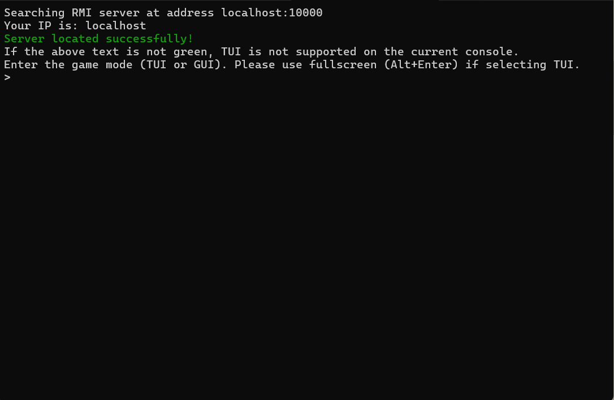
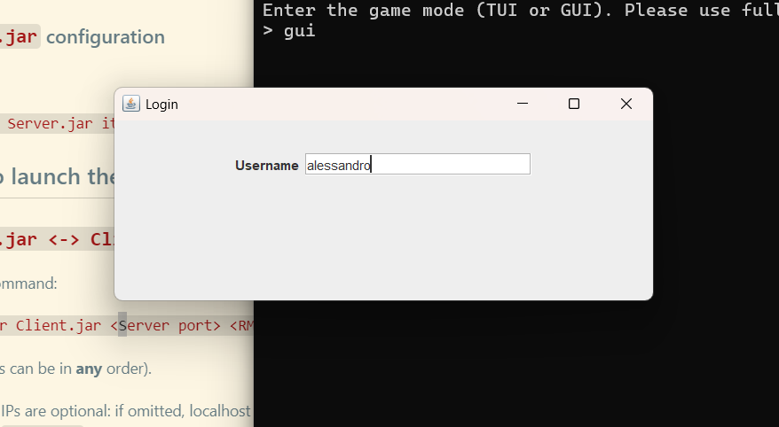
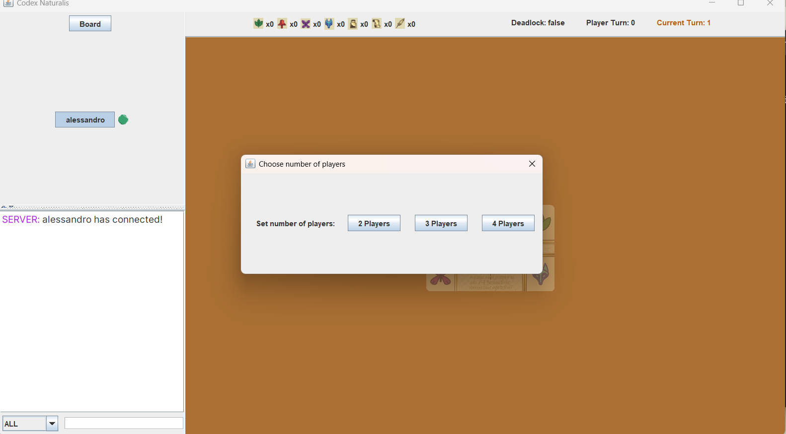

<h1 align="center">
    
</h1>

    <a href="https://github.com/AlessandroRuzza" target="_blank" title="Alessandro Ruzza's GitHub page">@Alessandro Ruzza</a>
    <a href="https://github.com/maddalenapanceri" target="_blank" title="Maddalena Panceri's GitHub page">@Maddalena Panceri</a>
     
    <a href="https://github.com/australopithe" target="_blank" title=" Flavio Villa's GitHub page">@Flavio Villa</a>
    <a href="https://github.com/Gab-San" target="_blank" title="Gabriele Santandrea's GitHub page">@Gabriele Santandrea</a>

---

<ins>The image above is property of [hutter-trade](https://hutter-trade.com/sortiment/produkt/codex-naturalis-von-huch/)</ins>.

This project consists in the digitalization of a board game using the java language, previously introduced in the course of _Ingegneria del Software_ (Software Engineering).

## Table of Contents

- [Download](#download)
- [Usage](#usage)
  - [Navigate the application](#navigate-the-application)
  - [TUI Notes](#tui-notes)
- [Project Requirements](project-requirements)
- [Game Rules](#rules)
- [License](#license)

## Download

Check out the [latest release](https://github.com/Gab-San/ing-sw-2024-Panceri-Ruzza-Santandrea-Villa/releases/latest) and download the files (preferably all in the same folder).

## Usage

**Navigate** to the folder where you downloaded your **files** and follow the instructions:

> Warning: the `Server.jar` and `FatJar.jar` have to be run with different commands! For correct compatibility, stick with either `Server.jar <-> Client.jar` configuration or `FatJar.jar` configuration

### How to launch the Server

#### `Server.jar <-> Client.jar` configuration

Run the command: 

`java -jar Server.jar <RMI port> <TCP port> [Server IP]` 

(the **order** of the arguments is **important**)

> The IP can be omitted: the app will list the local machine IPs and prompt the user to select one of them (other than `localhost`)

#### `FarJar.jar` configuration

Run:

`java -cp Server.jar it.polimi.ingsw.network.Server <RMI port> <TCP port> [Server IP]`

### How to launch the Client

#### `Server.jar <-> Client.jar` configuration

Run the command:

`java -jar Client.jar <Server port> <RMI | TCP> [Server IP] [myIP=<Client IP>]` 

(arguments can be in **any** order).

- The IPs are optional: if omitted, localhost will be used;
- The `myIP=<IP>` argument is also optional, as it is only used by RMI. It must be an IP reachable by the server.

#### `FatJar.jar` configuration

Replace `Client.jar` with `FatJar.jar` in the command right above👆:

`java -jar FatJar.jar <Server port> <RMI | TCP> [Server IP] [myIP=<Client IP>]`

### Notes (on both Client and Server)

Please note that compiling the project using Maven creates a FatJar.

- The IP arguments can be hostnames instead of IP addresses (a.b.c.d)
- All arguments other than IPs/Hostnames are validated on launch and the app will quit if an argument is invalid.
- If the IP/Hostname argument is invalid, the app will instead list all available IPs on the local machine and prompt the user to input a valid IP address.
- If a machine only has one IP (other than localhost) then that IP will be used automatically.

### Navigate the application

The first thing that should appear when looking should be a message that asks which kind of UI to use.

The options are:

- [TUI](#tui)
- [GUI](#gui)

#### TUI

The TUI (Text User Interface) is an interactive terminal that lets the user control the program through a set of commands.

The command syntax is the following:

`command value|other value|<player_id>`

- **command** is the command keyword (it is always the first word). Commands are listed below👇;
- `<description>` indicates a command argument ;
- `value` indicates an argument that must be the given value;
- `value|<description>|other value` indicates multiple alternatives for that argument (only use one);

A list of TUI commands:

| Command | Description |
| ---------- | ------------ |
| help | list all available commands |
| view | change screen to view other play areas or the main board |
| place | play one of the cards into your hand |
| draw | draw a card from the specified deck |
| flip | filp one of your cards upside down |
| move | **on play area view** move your view in the specified direction |
| send | send a message to another player |

More information about TUI commands in the [MANUAL](./other/manual.md).

##### TUI notes

The TUI uses ANSI color codes. They should show correctly on Mac/Linux consoles, but they are disabled on Windows CMD by default.

You can enable them by following the instruction below:

1. Press `Win+R`
2. Type `regedit` and press enter or click on ok
3. Navigate to `HKEY_CURRENT_USER\Console`
4. Check if the `VirtualTerminalLevel` value is present:
    - **If _not_ present** then right-click on the `Console` directory and press `New -> DWORD` to add it with value `1`
    - Otherwise change its value to `1`

#### GUI

The GUI (Graphical User Interface) is what you'll be more accustomed since most of modern applications usually have one.

When prompted as the first screen, insert a nickname and press enter to attempt connecting to the server.

After this screen if you are the first player to connect you will be prompted to select the number of players in the lobby:

If ever in doubt check the [MANUAL](./other/manual.md)

## Project Requirements

The integral version of project requirements can be found [here](./other/requirements.pdf).

### Features

| Requirements | Max Reachable Grade | Implemented |
| :------------- | :-------: | :-------------: |
| Simplified Rules + TUI + RMI or Socket | 18 | ✅ |
| Complete Rules + TUI + RMI or Socket | 20 | ✅ |
| Complete Rules + TUI + RMI or Socket + 1 AF | 22 | ✅ |
| Complete Rules + TUI + GUI + RMI or Socket + 1 AF | 24 | ✅ |
| Complete Rules + TUI + GUI + RMI + Socket + 1 AF | 27 | ✅ |
| Complete Rules + TUI  + GUI + RMI + Socket + 2 AF | 30 | ✅ |
| Complete Rules + TUI + GUI + RMI + Socket + 3 AF | 30L | ❌ |

---

| Advanced functionalities | Description | Implemented |
|:------------------------:|:------------|:-----------:|
| Multiple matches | Handle more matches simultaneously | ❌ |
| Persistance | Set up periodic saves so that a match can be restored even if a server crash occurs | ❌ |
| Disconnection resilience | Reconnect disconnected or crashed users | ✅ |  
| Chat | Let players send messages via chat | ✅ |

## Rules

For a thorough description of the rules check the [RULE-BOOK](./other/rule-book.md)

## License

_Codex Naturalis is a board game developed and published by Cranio Creations SRL_.

The graphic content of this project related to the board game is used with the prior approval of Cranio Creations SRL solely for educational purposes. **Distribution, copying, or reproduction of the content and images in any form outside the project is prohibited**, as is the redistribution and publication of the content and images for purposes other than those mentioned above. The commercial use of the aforementioned content is also prohibited.
