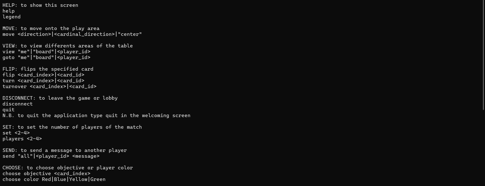
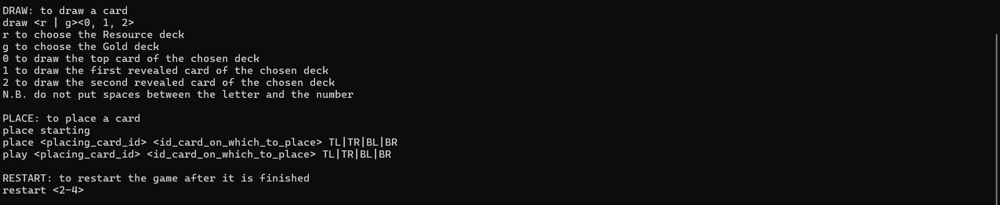
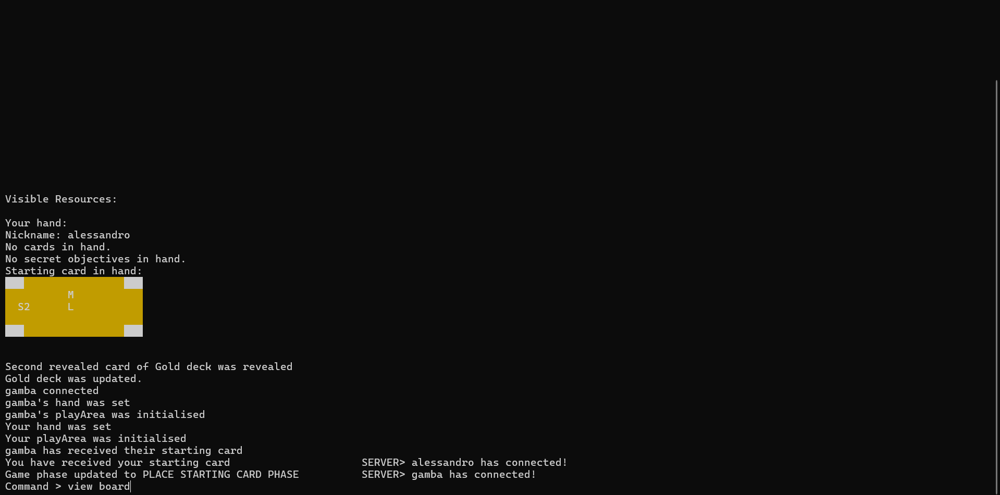
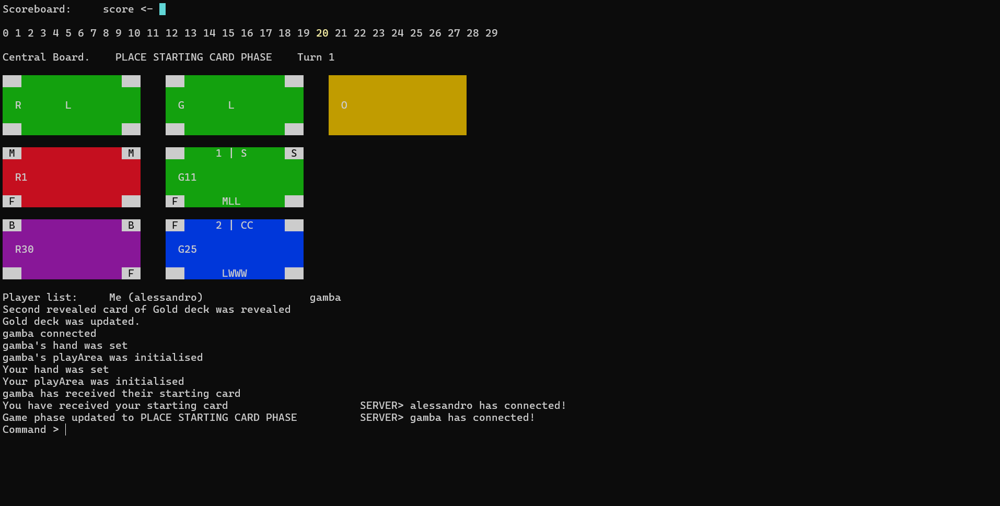
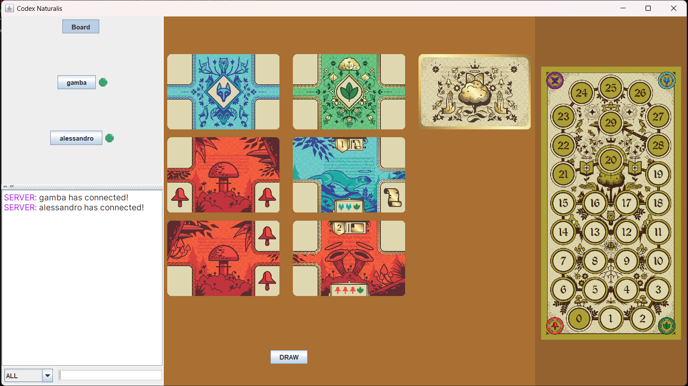
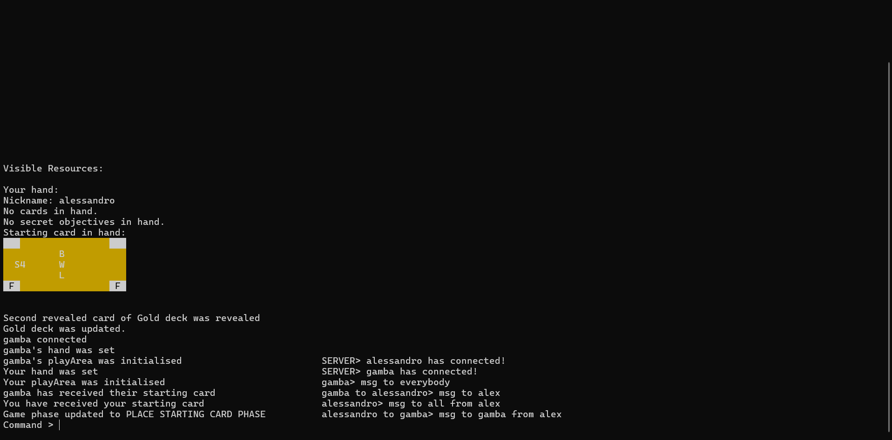
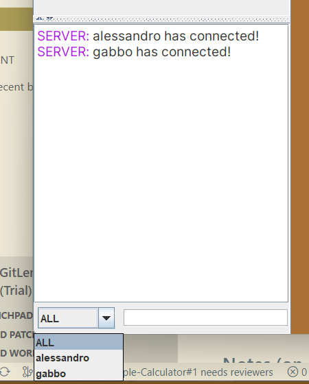
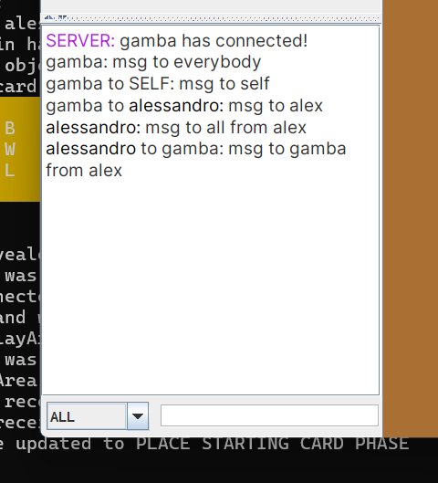
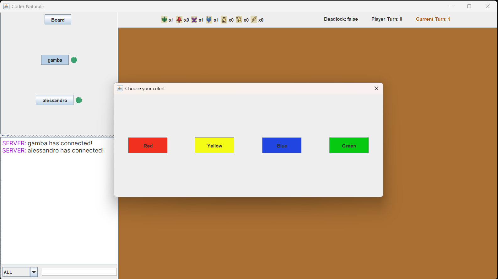

<h1 align="center">User Manual</h1>

## Table of Contents

- [Commands](#commands)
- [Cards](#cards)

## Commands

The command syntax for the TUI is the following:

`command me|board|<player_id>`

- **command** is the command keyword (it is always the first word). Commands are listed below👇;
- `<description>` indicates a command argument: it must be replaced with an argument that fits the description;
- `value` indicates an argument that must be the given value ;
- `value|<description>|other value` indicates multiple alternatives for that argument (only use one);

> `<2-4>` means number ranging from 2 to 4 ends included

Full list of commands:

| Command | Description |
| ---------- | ------------ |
| [help](#help) | list all available commands |
| [view](#view) | change screen to view other play areas or the main board |
| [place](#place) | play one of the cards into your hand |
| [draw](#draw) | draw a card from the specified deck |
| [flip](#flip) | filp one of your cards upside down |
| [move](#move) | **on play area view** move your view in the specified direction |
| [send](#send) | send a message to another player |
| [disconnect](#disconnect) | disconnect from current game |
| [set](#set) | **only during lobby setup** set the lobby's number of players |
| [choose](#choose) | **only during choosing states** choose between options |
| [restart](#restart) | **only after endgame** restart lobby|

### Help

Print the list of available commands.

> **ALIAS**: `legend`

### View

Change the visualized portion of the table.

**TUI**

Command Syntax: `view me|board|<player_identifier>`

> EXAMPLE: `view me` changes the screen to the user play area; `view gabriele` shows the play area related to gabriele (a connected user).

The **board** is comprehensive of the decks and the scoreboard; also shows additional information about the players.

Before the view command the visualized area is the user play area:

After the view command with "board" as argument the visualized area is the main board:

---

**GUI**

Press one of the player names in the sidebar to view their play area.

### Draw

Draw a card from the selected deck.

**TUI**

Command Syntax: `draw <r|g><0|1|2>` without spaces between the two characters.

- r: resource deck;
- g: gold deck;
- 0: top card;
- 1: first revealed card;
- 2: second revealed card;

> EXAMPLE: `draw r0` draws the top card of the resource deck; `draw g2` draws the second revealed card of the gold deck.

---

**GUI**

### Place

Place a card from your hand onto your play area.

**TUI**

Command Syntax:

- `place starting` to place the starting card
- `place <placing_card_id> <target_card_id>  TL|TR|BL|BR` to place any other card

- TL: top-left;
- TR: top-right
- BL: bottom-left;
- BR: bottom-right;

> **ALIAS**: `play`

> EXAMPLE: `place r20 r12 TL` place r20 on the top-left corner of r12 (already placed); `play g12 r20 BR` place g12 on the bottom-right corner of r20

---

**GUI**

1. Select a card in your hand;
2. Select one of the highlighted corners on the play area.

### Flip

Flip the selected card in your hand.

**TUI**

Command Syntax: `flip <card_index>|<card_id>`

> **ALIAS**: `turn`, `turnover`

> EXAMPLE: `flip r20` flips card with id r20 (in your hand); `turn 2` flips the second card in your hand

---

**GUI**

1. Hover with the mouse cursor over the card you want to flip;
2. Press **F**.

### Move

Move inside a play area.

**TUI**

Command Syntax: `move <direction>|<cardinal_direction>|center`

- direction: `up|down|left|right`
- cardinal_direction: `north|south|west|east|northeast|northwest|southeast|southwest`
- center: centers the view on the starting card

> EXAMPLE: `move up` moves the view up by one card; `move southeast` moves the view down by one card and then right by one card

---

**GUI**

1. Press on the area background;
2. Move around using W A S D to move up/left/down/right.

### Send

Send a message to a player, to self or to everybody

**TUI**

Command Syntax: `send all|<player_id>`

> `player_id` can be sender's nickname

> EXAMPLE: `send all hello everybody!` sends "hello everybody" to everyone; `send gabriele hello gab!` sends "hello gab!" only to gabriele (a connected player)

**GUI**

1. Use the dropdown menu in the chat to select the player to receive the message;

2. Write the message to the player;
3. Press enter to send.

### Disconnect

Disconnect from the game.

**TUI**

Command Syntax: `disconnect`

---

**GUI**

Close the application.

### Set

**Only when the first one to join the lobby**, set the lobby's number of players

**TUI**

Command Syntax: `set <2-4>`

---

**GUI**

Select one of the options given.

### Choose

**Only when prompted to choose**, choose the objective card or pick your colour.

**TUI**

Command Syntax:

- `choose objective <card_index>` to choose the objective card
- `choose color Red|Blue|Yellow|Green` to pick the color

---

**GUI**

Select one of the options given.

### Restart

**Only after endgame**, try to start a new lobby with the specified number of players. If the number of players selected is lower then the currently connected players, the server will create a new lobby with the current connected players.

**TUI**

Command Syntax: `restart <2-4>`

---

**GUI**

Onto the endgame screen, select one of the given options.

## Cards
